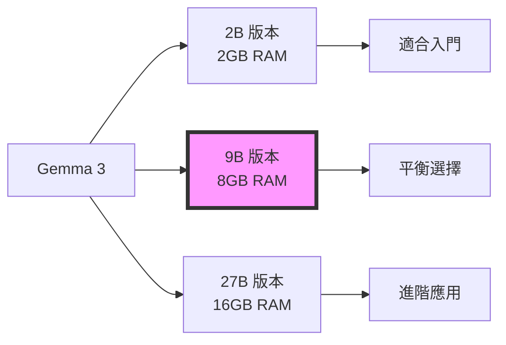

# 本地大型語言模型的實踐與應用 - 2025 秋季

## 🎯 課程定位：為企管系學生量身打造

### 目標學生
- **企管系高年級學生**：具備基礎商業知識，想學習 AI 應用
- **企管系研究生**：需要 AI 工具進行研究或實務應用
- **先備知識**：基礎電腦操作即可，無需程式設計經驗

### 課程特色調整
- 📊 **商業案例導向**：每週使用真實商業情境
- 🛠️ **低程式門檻**：提供完整程式碼，專注於應用
- 💼 **實務整合**：結合行銷、客服、人資、財務等領域
- 🎓 **研究工具**：協助論文寫作、資料分析、文獻整理

---

## 🤖 2025 年秋季最新模型建議

### 主要推薦模型

#### 1. **Google Gemma 3 系列** ⭐ 課程主力


**Gemma 3 特色**：
- ✅ **網路搜尋能力**：內建網路資訊檢索
- ✅ **多語言支援**：中英文表現優異
- ✅ **商業友好授權**：可商用
- ✅ **輕量高效**：9B 版本最適合筆電

#### 2. **Meta Llama 3.2 系列**
- **Llama 3.2 1B/3B**：超輕量，適合手機/邊緣設備
- **Llama 3.2 11B**：平衡性能與資源
- **Llama 3.2 90B**：需要 GPU 集群（選修）

#### 3. **Mistral 系列**
- **Mistral 7B v0.3**：程式碼生成能力強
- **Mixtral 8x7B**：MoE 架構，效能優異
- **Mistral Small 2**：22B，商業應用

#### 4. **Microsoft Phi 系列**
- **Phi-3.5 Mini (3.8B)**：微軟最新，極度優化
- **Phi-3.5 Small (7B)**：適合文檔處理
- **Phi-3.5 Medium (14B)**：進階推理

#### 5. **阿里 Qwen 2.5 系列**
- **Qwen 2.5 0.5B-72B**：中文最強
- **Qwen 2.5-Coder**：程式專用
- **Qwen-VL**：多模態（圖文）

### 模型選擇策略

| 硬體配置 | 建議模型 | 適用場景 |
|---------|---------|---------|
| 8GB RAM | Gemma 3 2B, Phi-3.5 Mini | 基礎對話、簡單分析 |
| 16GB RAM | Gemma 3 9B, Llama 3.2 11B | 複雜任務、RAG 應用 |
| 32GB RAM + GPU | Mixtral 8x7B, Qwen 2.5 32B | 專業應用、研究 |

---

## 📚 調整後的 13 週課程大綱

### 🔰 第一階段：基礎入門（Week 1-3）
*降低技術門檻，增加商業情境*

#### Week 1: AI 助理初體驗
- **商業情境**：建立個人工作助理
- **實作**：
  - 安裝 Ollama（圖形化界面）
  - 運行 Gemma 3 270M / 1B
  - 客服對話機器人
- **商業案例**：ChatGPT 在企業中的應用

#### Week 2: 與 AI 有效溝通
- **商業情境**：撰寫行銷文案、商業報告
- **實作**：
  - 5 種 Prompt 技巧
  - 自動生成商業文件
  - Email 自動回覆系統
- **商業案例**：Jasper AI 行銷應用

#### Week 3: Prompt Engineering 實作
- **商業情境**：專業文件撰寫與自動化
- **實作**：
  - Zero-shot、Few-shot、Chain-of-Thought 技巧
  - 結構化輸出（JSON / CSV）
  - 智慧表單處理與優先級判斷
- **商業案例**：文案與客服自動化平台

### 📊 第二階段：知識管理（Week 4-7）
*聚焦企業知識管理與文檔處理*

#### Week 4: RAG 暖身與專案提案
- **商業情境**：企業知識庫即時問答
- **實作**：
  - 使用 `week04_rag/rag_test.py` 以 Gemma3:1b 建立文件 RAG
  - PDF 切割、向量化與 FAISS 檢索流程
  - 比較有／無 RAG 的回答品質（Multi-Agent Debate 主題）
- **課堂活動**：
  - 分組提出期末專案構想並評估資料來源
  - 設計初步技術架構與驗證方法
- **商業案例**：企業研究團隊決策支援平台

#### Week 5: 智慧搜尋與問答
- **商業情境**：客戶服務知識庫
- **實作**：
  - RAG 系統（簡化版）
  - FAQ 自動回答
  - 產品說明書查詢
- **商業案例**：Zendesk AI

#### Week 6: 進階資訊檢索
- **商業情境**：市場研究與競品分析
- **實作**：
  - 網路資訊整合（Gemma 3 搜尋功能）
  - 多文檔比較分析
  - 自動報告生成
- **商業案例**：商業情報系統

#### Week 7: AI 應用介面設計
- **商業情境**：部門 AI 工具平台
- **實作**：
  - Streamlit 網頁介面
  - 聊天機器人 UI
  - 資料視覺化整合
- **商業案例**：企業 AI 平台

### 🚀 第三階段：智慧應用（Week 8-11）
*實用商業 AI 應用開發*

#### Week 8: AI 業務助理
- **商業情境**：銷售流程自動化
- **實作**：
  - 客戶資料分析
  - 銷售話術生成
  - 報價單自動製作
- **商業案例**：Salesforce Einstein

#### Week 9: AI 決策支援系統
- **商業情境**：管理決策輔助
- **實作**：
  - 資料分析 Agent
  - SWOT 自動分析
  - 風險評估報告
- **商業案例**：McKinsey AI 工具

#### Week 10: 多模態商業應用
- **商業情境**：產品圖文分析
- **實作**：
  - 產品圖片描述生成
  - 社群媒體內容分析
  - 品牌形象監測
- **商業案例**：Instagram Shopping AI

#### Week 11: 客製化 AI 模型
- **商業情境**：產業專用 AI
- **實作**：
  - 公司專屬 AI 訓練（LoRA）
  - 產業術語學習
  - 品牌語氣調整
- **商業案例**：產業 AI 解決方案

### 🎯 第四階段：整合實戰（Week 12-13）

#### Week 12: AI 系統整合
- **商業情境**：跨部門 AI 協作
- **實作**：
  - API 服務建置
  - 系統整合實務
  - 效能優化
- **商業案例**：企業 AI 轉型

#### Week 13: 期末專案發表
- **專案選項**（商業導向）：
  1. 🛍️ **智慧電商助理**：產品推薦、客服、訂單處理
  2. 📈 **市場分析平台**：競品分析、趨勢預測、報告生成
  3. 👥 **HR 智慧系統**：履歷篩選、面試問題、員工問答
  4. 💰 **財務分析助手**：報表解讀、風險評估、投資建議
  5. 📱 **社群媒體管理**：內容生成、情感分析、互動回覆

---

## 💻 程式碼調整建議

### 降低程式門檻策略

1. **提供 GUI 版本**
```python
# 原本的命令列版本
response = ollama.chat(model='gemma3:9b', messages=[...])

# 新增 Gradio GUI 版本
import gradio as gr

def chat_with_ai(message, history):
    # 簡化的對話函數
    response = ollama.chat(
        model='gemma3:9b',
        messages=[{"role": "user", "content": message}]
    )
    return response['message']['content']

# 一行啟動介面
gr.ChatInterface(chat_with_ai).launch()
```

2. **預設商業模板**
```python
# 提供現成的商業 Prompt 模板
templates = {
    "email_reply": "請用專業且友善的語氣回覆這封郵件：{content}",
    "market_analysis": "分析以下市場資料並提供洞察：{data}",
    "meeting_summary": "總結這次會議的重點和行動項目：{notes}",
    "swot_analysis": "對{company}進行 SWOT 分析",
    "customer_response": "回覆這個客戶投訴，表達歉意並提供解決方案：{complaint}"
}
```

3. **視覺化配置檔**
```yaml
# config.yaml - 學生只需修改設定檔
model:
  name: gemma3:9b
  temperature: 0.7
  
business_settings:
  company_name: "範例企業"
  industry: "零售業"
  tone: "專業友善"
  language: "繁體中文"
```

---

## 📊 評量方式調整

### 適合企管系學生的評量

| 項目 | 比重 | 說明 |
|------|------|------|
| 商業應用實作 | 40% | 每週小作業，使用 AI 解決商業問題 |
| 期中報告 | 25% | AI 工具在特定產業的應用分析 |
| 期末專案 | 25% | 團隊開發商業 AI 應用 |
| 課堂參與 | 10% | 討論商業案例、分享應用經驗 |

### 作業範例（商業導向）

**Week 1 作業**：使用 AI 助理完成以下任務
- 撰寫一封商業提案信
- 分析一家公司的新聞稿
- 生成產品行銷標語

**Week 5 作業**：建立部門知識庫
- 上傳 5 份公司文件
- 設定 10 個常見問題
- 測試問答準確度

---

## 🌐 Gemma 3 網路搜尋功能應用

### 商業應用場景

1. **即時市場監測**
```python
# 使用 Gemma 3 的網路搜尋能力
prompt = """
搜尋並分析最近一週關於「電動車產業」的新聞，
提供：
1. 主要趨勢
2. 重要事件
3. 投資機會
4. 風險警示
"""
```

2. **競品分析**
```python
prompt = """
搜尋並比較以下三家公司的最新動態：
- 公司A
- 公司B  
- 公司C

分析他們的：
- 最新產品
- 市場策略
- 財務表現
"""
```

3. **客戶洞察**
```python
prompt = """
搜尋社群媒體上關於我們品牌的討論，
分析：
- 客戶情感
- 主要抱怨
- 改進建議
"""
```

---

## 📚 推薦閱讀（商業取向）

### 商業 AI 書籍
- 《AI 轉型策略》- 企業導入 AI 的實務指南
- 《智慧商務》- AI 在各產業的應用案例
- 《The AI Advantage》- MIT 商業 AI 應用

### 線上資源
- Harvard Business Review - AI 專欄
- MIT Sloan - AI 商業應用課程
- Coursera - AI for Business Specialization

### 商業案例庫
- McKinsey AI 案例研究
- BCG AI 成功故事
- Gartner AI 趨勢報告

---

## 🎓 給企管系學生的建議

### 學習路徑
1. **不要害怕程式碼**：我們提供完整程式，只需要會複製貼上
2. **專注於應用**：理解 AI 能做什麼，而非如何做
3. **結合專業知識**：將 AI 與你的商業知識結合
4. **實務導向**：每個工具都思考如何用在未來工作

### 職涯發展
- **AI 產品經理**：理解 AI 能力與限制
- **商業分析師**：使用 AI 工具進行分析
- **數位轉型顧問**：協助企業導入 AI
- **AI 創業**：開發商業 AI 應用

---

**Last Updated**: 2025-01-10
**Semester**: 2025 Fall
**Target Students**: Business Management Senior/Graduate