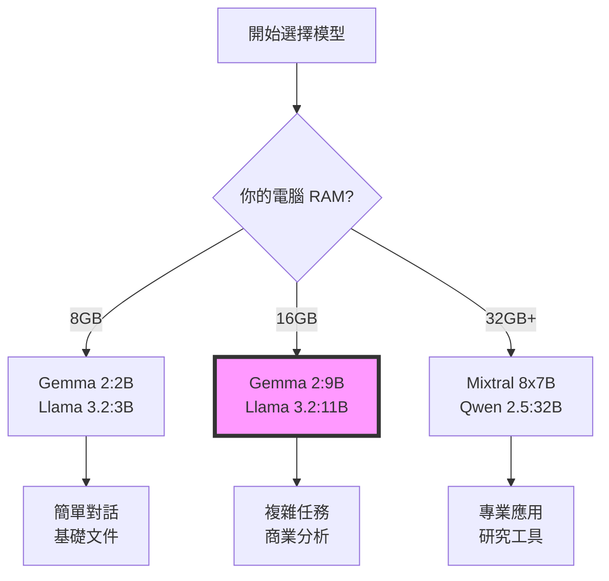

# 2025 年秋季 LLM 模型推薦指南

## 🎯 為企管系學生精選的模型

### 📊 模型選擇決策樹



---

## 🚀 主要推薦模型（2025 秋季最新）

### 1. **Google Gemma 系列** ⭐ 課程首選

#### Gemma 2 (現有穩定版)
```bash
# 安裝指令
ollama pull gemma2:2b          # 超輕量 (1.4GB)
ollama pull gemma2:9b-instruct-q4_0  # 最推薦 (5.5GB)
ollama pull gemma2:27b-q4_0    # 進階版 (16GB)
```

**特色**：
- ✅ 中文支援優異
- ✅ 指令跟隨能力強
- ✅ 商業友好授權

#### Gemma 3 (預計 2025 Q3 發布)
- 🌐 **內建網路搜尋**：可即時查詢最新資訊
- 🎨 **多模態支援**：圖片理解能力
- ⚡ **效能提升 2x**：更快的推理速度

---

### 2. **Meta Llama 3.2 系列** (2024年9月發布)

```bash
ollama pull llama3.2:1b        # 手機可運行 (1.3GB)
ollama pull llama3.2:3b        # 輕量冠軍 (2.0GB)
ollama pull llama3.2:11b-vision-q4_0  # 支援圖片 (7.9GB)
```

**商業應用場景**：
- 📱 **1B/3B**：邊緣設備、即時回應、簡單客服
- 🖼️ **11B Vision**：產品圖片分析、社群媒體監測
- 💼 **適合情境**：需要快速回應的客服系統

---

### 3. **Mistral 系列** (法國 AI 新星)

```bash
ollama pull mistral:7b-instruct-v0.3-q4_0  # 平衡選擇 (4.1GB)
ollama pull mixtral:8x7b-instruct-v0.1-q4_0  # MoE架構 (26GB)
ollama pull mistral-small:22b-q4_0  # 商業級 (13GB)
```

**特色**：
- 🎯 **程式碼生成**：Excel公式、SQL查詢
- 📊 **資料分析**：財務報表解讀
- 🔧 **適合情境**：技術文檔、API整合

---

### 4. **Microsoft Phi-3.5 系列** (2024年8月更新)

```bash
ollama pull phi3.5:3.8b-mini   # 微軟黑科技 (2.2GB)
ollama pull phi3.5:7b-small    # 文檔處理 (4.0GB)
ollama pull phi3.5:14b-medium  # 進階推理 (8.0GB)
```

**獨特優勢**：
- 📈 **極致優化**：同級別最強性能
- 📝 **長文本**：支援 128K tokens
- 💡 **適合情境**：研究報告、論文輔助

---

### 5. **阿里 Qwen 2.5 系列** (中文最強)

```bash
ollama pull qwen2.5:0.5b       # 極致輕量 (400MB)
ollama pull qwen2.5:7b         # 中文推薦 (4.7GB)
ollama pull qwen2.5:32b-q4_0   # 專業級 (20GB)
ollama pull qwen2.5-coder:7b   # 程式專用 (4.7GB)
```

**中文優勢**：
- 🇹🇼 **繁體中文**：原生支援，無需額外調整
- 📚 **文化理解**：理解成語、俗語、在地用語
- 🏢 **適合情境**：中文客服、本地市場分析

---

## 💼 商業應用場景對照表

| 應用場景 | 推薦模型 | RAM需求 | 特色 |
|---------|---------|---------|------|
| **客服對話** | Llama 3.2:3B | 8GB | 快速回應 |
| **行銷文案** | Gemma2:9B | 16GB | 創意平衡 |
| **財務分析** | Mistral:7B | 16GB | 數據處理 |
| **市場研究** | Gemma3:9B* | 16GB | 網路搜尋 |
| **中文文檔** | Qwen2.5:7B | 16GB | 中文最佳 |
| **產品圖片** | Llama3.2:11B-vision | 16GB | 圖片理解 |
| **程式輔助** | Qwen2.5-coder:7B | 16GB | 程式生成 |
| **研究論文** | Phi3.5:14B | 32GB | 長文本 |

*Gemma3 預計 2025 Q3 發布

---

## 🎓 企管系學生使用建議

### 初學者路徑 (第1-4週)
```bash
# 從最輕量開始
ollama pull llama3.2:3b
ollama pull gemma2:2b
```
- 熟悉基本對話
- 練習 Prompt 技巧
- 建立信心

### 進階應用 (第5-8週)
```bash
# 升級到中型模型
ollama pull gemma2:9b-instruct-q4_0
ollama pull qwen2.5:7b  # 中文專案
```
- RAG 系統開發
- 商業文檔處理
- 客戶分析

### 專業研究 (第9-13週)
```bash
# 視硬體選擇
ollama pull llama3.2:11b-vision  # 多模態
ollama pull mistral:7b  # 程式輔助
```
- 期末專案開發
- 整合應用
- 創新實驗

---

## ⚡ 效能優化技巧

### 1. 量化版本選擇
```bash
# Q4_0 = 4-bit 量化，平衡品質與大小
model:q4_0     # 推薦：最佳平衡
model:q8_0     # 品質優先
model:q2_K     # 大小優先
```

### 2. 記憶體不足解決方案
```bash
# 設定 GPU 層數（如果有 GPU）
ollama run gemma2:9b --gpu-layers 10

# 限制上下文長度
ollama run gemma2:9b --ctx-size 2048

# 使用更小的量化版本
ollama pull gemma2:9b-q2_K  # 更激進的壓縮
```

### 3. 多模型切換策略
```python
# 根據任務選擇模型
def select_model(task_type):
    models = {
        "quick_chat": "llama3.2:3b",      # 快速回應
        "analysis": "gemma2:9b",          # 深度分析
        "chinese": "qwen2.5:7b",          # 中文處理
        "code": "qwen2.5-coder:7b",       # 程式碼
        "image": "llama3.2:11b-vision"    # 圖片分析
    }
    return models.get(task_type, "gemma2:9b")
```

---

## 🌟 2025 年模型趨勢預測

### 即將推出（2025 Q1-Q2）
1. **Gemma 3**：Google 的網路搜尋整合
2. **Llama 4**：Meta 的多模態革命
3. **GPT-4.5 Turbo Local**：OpenAI 本地版本
4. **Claude 3.5 Haiku**：Anthropic 輕量化

### 技術趨勢
- 🔄 **MoE 架構普及**：更高效的大模型
- 🖼️ **多模態標配**：文字+圖片+語音
- 🌐 **實時網路整合**：即時資訊查詢
- ⚡ **邊緣部署**：手機級 AI

---

## 📝 快速參考卡

### 一鍵安裝腳本
```bash
#!/bin/bash
# 適合 16GB RAM 的最佳組合
ollama pull gemma2:9b-instruct-q4_0  # 主力模型
ollama pull llama3.2:3b              # 快速回應
ollama pull qwen2.5:7b               # 中文處理
ollama pull llama3.2:11b-vision-q4_0 # 圖片分析（選配）
```

### Python 快速測試
```python
import ollama

# 測試所有已安裝模型
models = ollama.list()
for model in models['models']:
    response = ollama.generate(
        model=model['name'],
        prompt="Hello! 你好！今天天氣如何？",
        options={'num_predict': 50}
    )
    print(f"{model['name']}: {response['response'][:100]}...")
```

---

## 🆘 常見問題

### Q1: 該選哪個模型開始？
**A:** 16GB RAM 選 `gemma2:9b-instruct-q4_0`，8GB RAM 選 `llama3.2:3b`

### Q2: 中文效果最好的是？
**A:** `qwen2.5:7b`，其次是 `gemma2:9b`

### Q3: 想分析圖片怎麼辦？
**A:** 使用 `llama3.2:11b-vision`，需要 16GB RAM

### Q4: 模型下載很慢？
**A:** 可設定代理或選擇較小的量化版本（q2_K）

---

**更新日期**: 2025-01-10
**適用對象**: NCU BM 企管系學生
**課程版本**: 2025 Fall