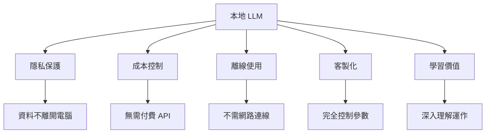
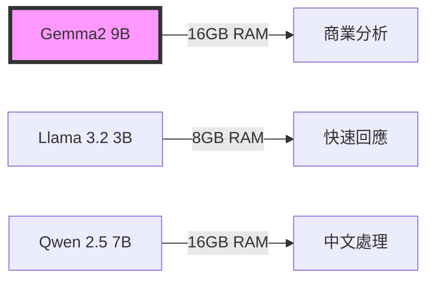
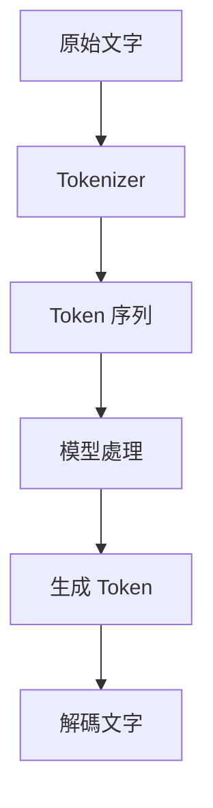
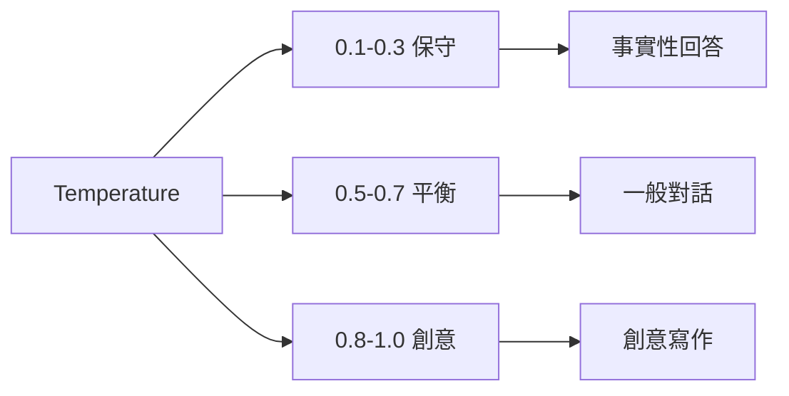

# Week 1: AI 助理初體驗
2025 Fall - 企業管理學系

---

## 課程目標

### 今日學習重點

1. **理解本地 LLM 的意義與優勢**
2. **完成開發環境設置**
3. **成功運行 Gemma 模型**
4. **建立個人 AI 助理原型**
5. **掌握基本概念**

---

## 為什麼要在本地運行 LLM？

### 五大優勢



---

## Ollama 簡介

### 什麼是 Ollama？

- **輕量級 LLM 執行框架**
- **類似 Docker 的使用體驗**
- **自動化模型管理**
- **內建 REST API**

### Ollama vs 其他方案

| 特性 | Ollama | Hugging Face | llama.cpp |
|------|--------|--------------|-----------|
| 安裝難度 | ⭐ | ⭐⭐⭐ | ⭐⭐ |
| 模型管理 | 自動化 | 手動 | 手動 |
| API 支援 | 內建 | 需設定 | 需設定 |

---

## 2025 秋季最新模型

### 推薦模型比較



### 選擇建議

- **8GB RAM**: Llama 3.2:3B 或 Gemma2:2B
- **16GB RAM**: Gemma2:9B (推薦)
- **中文專案**: Qwen2.5:7B

---

## 簡化安裝 (無需程式背景)

### Windows 用戶 (3步驟)

1. **下載 Ollama**
   - 點擊: https://ollama.com/download/windows
   - 雙擊安裝檔案

2. **開啟命令提示字元**
   - 按 Win+R, 輸入 cmd

3. **下載模型**
```bash
# 推薦模型
ollama pull gemma2:9b-instruct-q4_0
ollama pull llama3.2:3b
```

---

## Python 環境設置

### 建立虛擬環境

```bash
# 建立專案
mkdir ncu_bm_llm_2025F
cd ncu_bm_llm_2025F

# 建立虛擬環境
python -m venv venv

# 啟動環境
source venv/bin/activate  # Linux/Mac
venv\Scripts\activate     # Windows
```

### 安裝套件

```bash
pip install -r requirements.txt
```

---

## 第一個 LLM 程式

### Hello LLM!

```python
import ollama

# 簡單對話
response = ollama.chat(
    model='gemma:2b',
    messages=[{
        'role': 'user',
        'content': '你好！介紹一下你自己'
    }]
)

print(response['message']['content'])
```

### 執行程式

```bash
python week01_setup/01_hello_llm.py
```

---

## 關鍵概念：Token

### 什麼是 Token？



### Token 計算

| 文字 | Token 數 |
|------|----------|
| Hello World | ~2 |
| 機器學習 | ~2-3 |
| 一段中文句子 | ~10-15 |

---

## Temperature 參數

### 控制創造力



### 實驗代碼

```python
for temp in [0.1, 0.5, 0.9]:
    response = ollama.generate(
        model='gemma:2b',
        prompt="寫一句話",
        options={'temperature': temp}
    )
    print(f"Temp {temp}: {response['response']}")
```

---

## Lab 1: 個人 AI 助理

### 功能需求

```mermaid
graph TD
    A[個人助理] --> B[多輪對話]
    A --> C[記憶管理]
    A --> D[參數調整]
    A --> E[對話儲存]
    A --> F[特殊指令]
    
    F --> F1[/help]
    F --> F2[/clear]
    F --> F3[/save]
    F --> F4[/exit]
```

### 執行方式

```bash
python week01_setup/02_personal_assistant.py
```

---

## Ollama API 探索

### 主要 API 功能

1. **generate** - 文字生成
2. **chat** - 對話模式
3. **embeddings** - 向量化
4. **list** - 模型列表
5. **show** - 模型資訊

### 探索工具

```bash
python week01_setup/03_ollama_basics.py
```

---

## 作業與練習

### 本週作業

1. ✅ 完成環境設置
2. ✅ 運行所有範例程式
3. ✅ 實作個人助理
4. ✅ 測試不同 temperature
5. ✅ 探索 Ollama API

### 進階挑戰

- 添加更多助理功能
- 實作對話摘要
- 建立模型比較工具

---

## 商業案例分享

### 🏆 成功案例

1. **星巴克**: 使用 AI 客服節省 30% 成本
2. **Amazon**: AI 產品推薦提升 35% 銷售
3. **Netflix**: AI 個人化推薦系統
4. **台積電**: AI 品質檢測系統

### 💡 本地 LLM 優勢

- 資料不外洩（金融、醫療）
- 無限使用（無 API 費用）
- 客製化調整

---

## 下週預告

### Week 2: 與 AI 高效溝通

- **商業文案撰寫**
- **Email 自動回覆**
- **市場分析報告**
- **客戶意見分析**

### 準備事項

- 確保 Ollama 正常運行
- 熟悉基本 Python 操作
- 準備文字處理案例

---

## Q&A

### 常見問題

1. **Ollama 連接失敗？**
   - 確認服務運行中
   - 檢查防火牆設定

2. **模型下載很慢？**
   - 使用較小模型
   - 檢查網路連線

3. **記憶體不足？**
   - 使用量化版本
   - 關閉其他程式

---

## 感謝參與！

### 聯絡資訊

- 📧 講師信箱：lzrong0203@gmail.com
- 💻 程式碼：github.com/lzrong0203/ncu_bm_llm_2025F
- 📅 Office Hour：週四 14:00-16:00

### 記得完成作業！

**繳交期限：下週上課前**