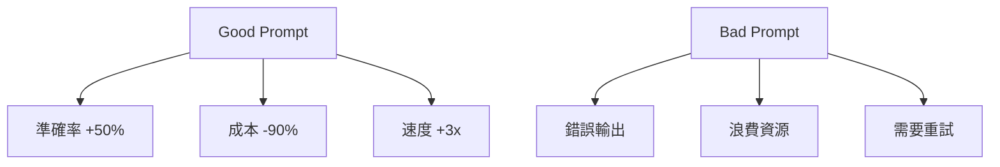
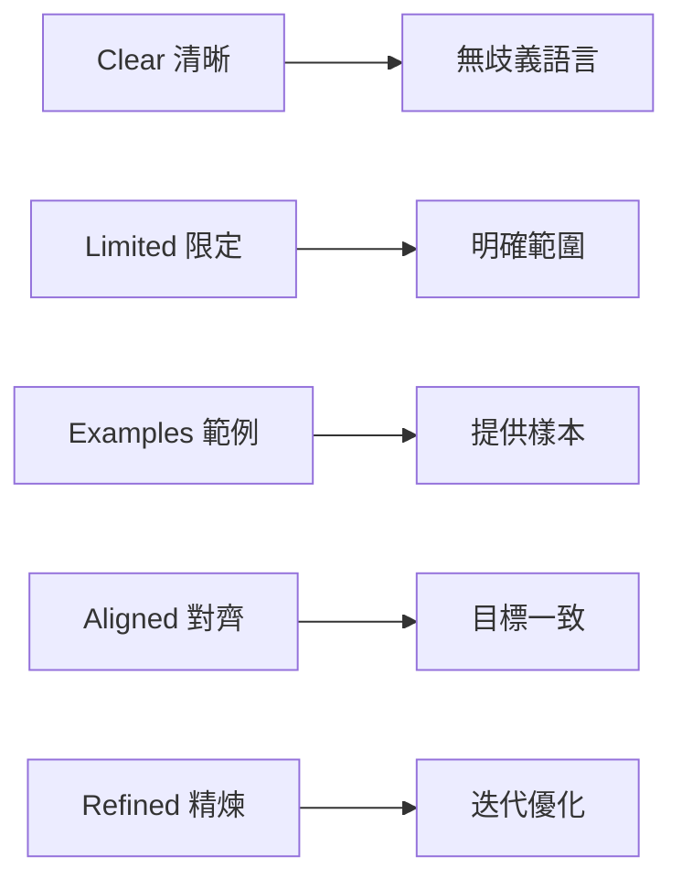
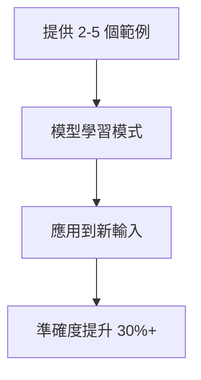
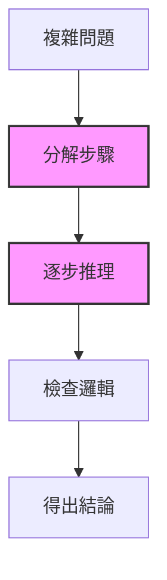
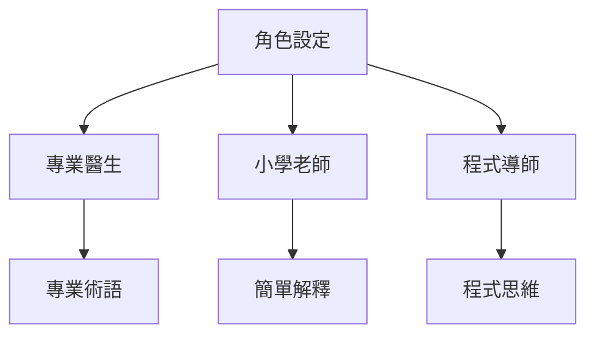
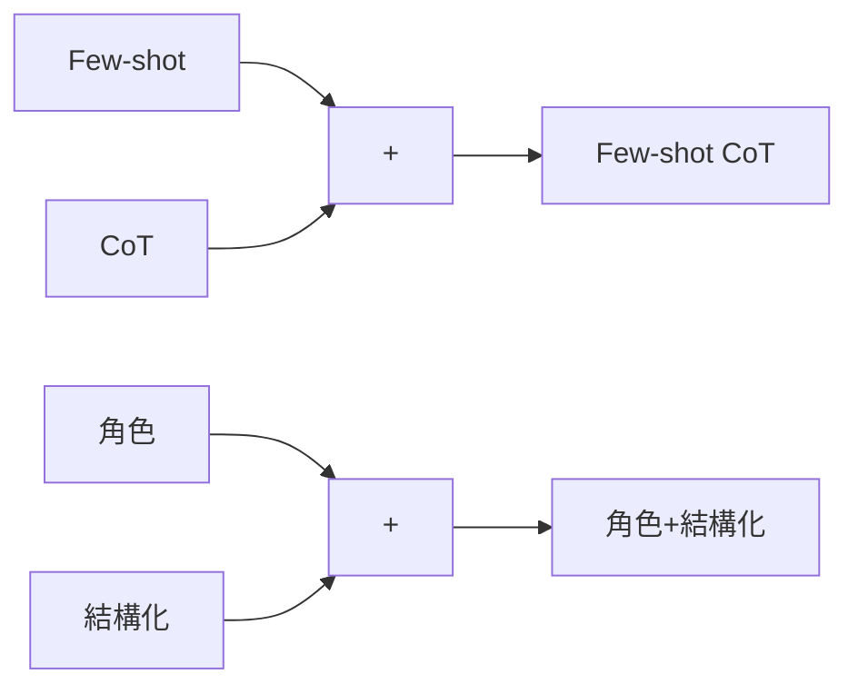
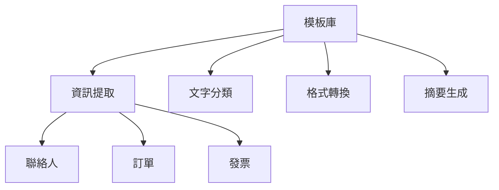
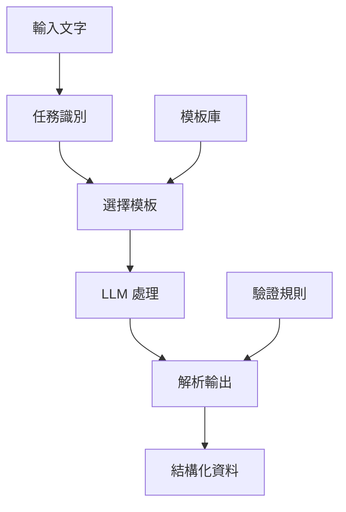
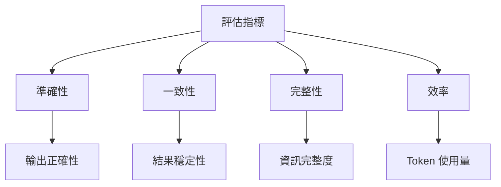
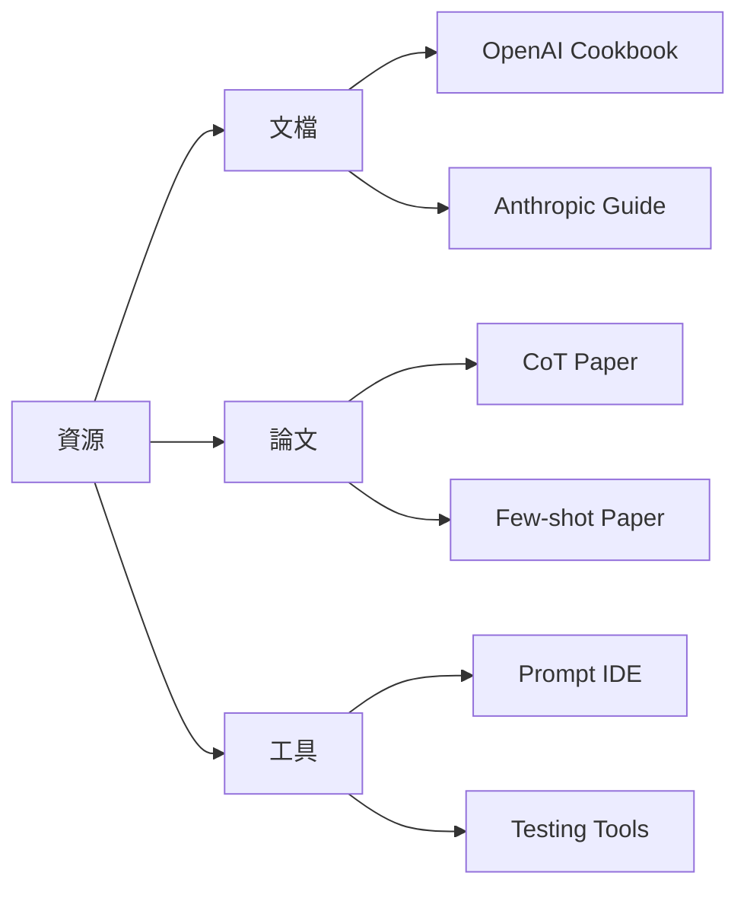

# Week 2: Prompt Engineering 精要

---

## 課程目標

### 今日學習重點

1. **掌握 Prompt Engineering 原則**
2. **精通 Zero-shot & Few-shot**
3. **實作 Chain-of-Thought**
4. **建立結構化輸出**
5. **開發 Prompt 模板庫**

---

## 為什麼 Prompt Engineering 重要？

### 關鍵影響



### 核心價值

- **效能差異巨大**
- **成本效益最高**
- **即時調整**
- **通用技能**

---

## CLEAR 框架

### Prompt Engineering 基本原則



### 實例對比

❌ **模糊**: "寫好一點"  
✅ **清晰**: "使用正式商業語氣，200字以內"

---

## Zero-shot Prompting

### 定義與特點

- **直接給出任務**
- **無需提供範例**
- **依賴預訓練知識**

### 範例

```python
prompt = """
判斷情感（正面/負面/中性）：

評論：服務很好但價格偏高
情感：
"""
# 輸出：中性
```

### 適用場景

- ✅ 簡單分類
- ✅ 常見任務
- ❌ 專業領域

---

## Few-shot Prompting

### 透過範例學習



### 實作範例

```python
prompt = """
情感評分（1-5分）：

評論：太棒了！ → 分數：5
評論：還可以 → 分數：3
評論：很差勁 → 分數：1

評論：相當不錯 → 分數：
"""
# 輸出：4
```

---

## Chain-of-Thought (CoT)

### 逐步思考的力量



### 標準 CoT 模板

```python
prompt = """
問題：商店有 156 個橘子，賣出 89 個，
進貨 234 個，現在有幾個？

讓我們一步步思考：
1. 原有：156 個
2. 賣出後：156 - 89 = 67 個
3. 進貨後：67 + 234 = 301 個

答案：301 個
"""
```

---

## Zero-shot CoT

### 魔法句子的威力

```python
prompt = """
問題：[複雜問題描述]

Let's think step by step.
"""
```

### 效果對比

| 方法 | 準確率 | Token 使用 |
|------|--------|-----------|
| Zero-shot | 60% | 少 |
| Zero-shot CoT | 78% | 中 |
| Few-shot CoT | 85% | 多 |

---

## 結構化輸出

### JSON 格式輸出

```python
prompt = """
分析文字並輸出 JSON：

文字：張三明天3點在台北101開會

格式：
{
    "person": "姓名",
    "time": "時間",
    "location": "地點",
    "event": "事件"
}

結果：
```json
{
    "person": "張三",
    "time": "明天3點",
    "location": "台北101",
    "event": "開會"
}
```
"""
```

---

## 角色扮演 Prompting

### 賦予 AI 特定身份



### 實例

```python
prompt = """
你是資深 Python 工程師，擅長程式碼審查。
請檢查以下程式碼並給出改進建議：

def add(a,b): return a+b
"""
```

---

## 進階技巧組合

### 混合使用策略



### 組合範例

```python
# Few-shot + CoT + 結構化
prompt = """
你是資料分析師。分析以下資料：

例1：銷售100 → 分析：成長10% → 建議：維持
例2：銷售80 → 分析：下降20% → 建議：促銷

當前：銷售90
讓我們逐步分析並輸出JSON格式...
"""
```

---

## Prompt 模板設計

### 建立可重用模板

```python
class PromptTemplate:
    def __init__(self, template):
        self.template = template
    
    def format(self, **kwargs):
        return self.template.format(**kwargs)

# 使用模板
template = PromptTemplate("""
角色：{role}
任務：{task}
要求：{requirements}
輸入：{input}
輸出：
""")
```

### 模板庫架構



---

## Lab 2: 智慧表單處理器

### 系統架構



### 五大功能

1. **資訊提取** - 從文字提取結構化資料
2. **文字分類** - 情感、意圖、優先級
3. **資料驗證** - 格式與完整性檢查
4. **格式轉換** - 日期、貨幣、單位
5. **摘要生成** - 簡短、詳細、要點

---

## 實作示範

### 執行智慧表單處理器

```bash
# 示範場景
python week02_prompt_engineering/03_smart_form_processor.py

# 選擇選項 1：示範場景
# 自動執行 5 個實用場景
```

### 場景列表

1. 聯絡資訊提取
2. 客戶意圖分類
3. 訂單資訊解析
4. 優先級判斷
5. 批次情感分析

---

## Prompt 效果評估

### 評估指標



### A/B 測試

```python
def compare_prompts(prompt_a, prompt_b, test_cases):
    for case in test_cases:
        result_a = test(prompt_a, case)
        result_b = test(prompt_b, case)
        # 比較準確率、速度、成本
```

---

## 常見錯誤與解決

### 避開陷阱

| 錯誤 | 問題 | 解決方案 |
|------|------|---------|
| 過度複雜 | 混亂輸出 | 分解步驟 |
| 格式不一致 | 解析失敗 | 統一範例 |
| 缺乏具體性 | 模糊結果 | 明確要求 |
| 忽略限制 | 超出能力 | 了解模型 |

### 最佳實踐

- ✅ 迭代優化
- ✅ 版本控制
- ✅ 效果測試
- ✅ 文檔記錄

---

## 本週作業

### 必做項目

1. **完成三個示範程式**
   - 01_prompting_basics.py
   - 02_structured_output.py
   - 03_smart_form_processor.py

2. **建立 5 個場景模板**
   - 不同領域
   - 不同技巧
   - 測試效果

### 進階挑戰

- 實作 Self-Consistency
- 開發 Prompt 優化工具
- 建立評估框架

---

## 實用資源

### 延伸學習



### 推薦閱讀

- 📖 Prompt Engineering Guide
- 📖 Chain-of-Thought 原論文
- 🔗 promptingguide.ai
- 💬 課程 Discord

---

## 下週預告

### Week 3: LangChain 核心概念

- **LangChain 架構**
- **LCEL 表達式**
- **Chain 建構**
- **模組化設計**

### 準備事項

- 安裝 LangChain
- 準備文檔資料
- 複習 Python OOP

---

## Q&A

### 常見問題

1. **JSON 解析失敗？**
   - 降低 temperature
   - 提供更多範例
   - 使用驗證工具

2. **輸出不一致？**
   - 固定 seed 值
   - 統一範例格式
   - 明確指定規則

3. **Token 超限？**
   - 精簡 prompt
   - 分批處理
   - 使用摘要

---

## 感謝參與！

### 本週重點回顧

✅ 掌握 5 種 Prompting 技巧  
✅ 建立結構化輸出  
✅ 實作智慧表單處理器  
✅ 設計模板庫  
✅ 學會評估優化

### 下週見！

**記得完成作業並上傳 GitHub**